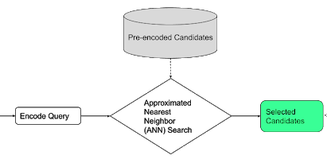
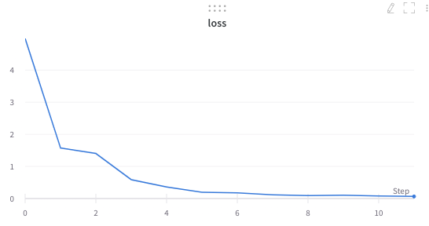
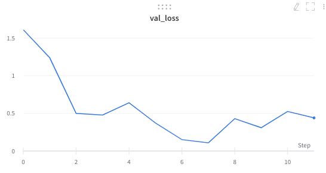

# Covid-19 Chatbot

**Covid-19 Chatbot** is a multi-lingual WhatsApp chatbot to answer FAQs about Covid-19 as per the WHO. It also has computer vision capabilities allowing a WhatsApp client to send a picture of a mask and the chatbot will classify the mask as either a N95, surgical or cloth mask.

## Features
* **Question-Answering chatbot** of COVID-19 FAQs
* **Multi-lingual language support**: English, Afrikaans, French and more (16 languages total)
* **Semantic task retrieval** for Question-Answer retrieval.
* **Computer Vision** model classification of types of masks
* **FastAPI endpoint** for chatbot deployment with **async event support**
* **Deployment to GCP (or any cloud provider)** is easy with the **Docker** container
* **Load testing** of API endpoint to quantify performance to traffic
* **Unit-testing** of modules


<p align="center">
  
</p>


## Table of Contents
  * [**Features**](#features)
  * [**Usage**](#usage)
  * [**WhatsApp Integration**](#whatsapp-integration)
  * [**Data**](#data)
  * [**Language Model & Embeddings**](#language-model--embeddings)
  * [**Image Classification: Convolutional Neural Network**](#image-classification-convolutional-neural-network)
  * [**FastAPI**](#fastapi)
  * [**Deployment**](#deployment)
  * [**Load testing**](#load-testing)
  * [**API Docs**](#api-docs)
  * [**Future Improvements**](#future-improvements)


## Usage
  * Package usage is command line based
  * To install all requirements run `pip install -r requirements.txt`
  * The usage of each component (data, language model, computer vision model, FastAPI) is listed under the respective sub-section with the Python command.


## WhatsApp Integration
* Integrating the chatbot with WhatsApp allows for easier and greater reach with users
* Twilio is used to interface the chatbot with WhatsApp


## Data
> Two sources of data are sourced for the chatbot - text data (FAQs) and image data (mask images)

* Text data (FAQs)
  * Chatbot training data is scraped from the [WHO FAQs](https://www.who.int/emergencies/diseases/novel-coronavirus-2019/question-and-answers-hub/q-a-detail/q-a-coronaviruses) on COVID-19
  * It consists of Question-Answer pairs of the most relevant questions and answers related to COVID-19.

```bash
python acquire_data.py [--url [URL TO SCRAPE]] [--output_file_name [H5 FILENAME]]
```

* Image data (Mask images)
    * Images of the 3 mask categories (N95, Surgical and cloth) were scraped from Google Images to train the CNN.
    * Approx 300 images per class were acquired with the masks by themselves or people wearing the masks to ensure all use cases were covered.


## Language Model & Embeddings
* [Universal Sentence Encoder (USE)](https://tfhub.dev/google/universal-sentence-encoder-multilingual-qa/3) is used to encode the text from the chatbot as a vector embedding.
* Semantic retrieval is then done for queries in order to find the most appropriate answer from a FAQ.
* As such the FAQs are transformed into a reference embedding of pre-encoded candidates which the chatbot will query at search time when the WhatsApp query comes in.
* To run the language model and create the reference embeddings run the following:
```bash
python train_lang_embedding.py [wandp_api [WANDB API KEY]] [--use_url [TF-HUB USE URL]] [--ref_filepath [H5 REF FAQ EMBEDDING FILEPATH]]
```

* The semantic retrieval task is carried out as shown in the figure below.
<h2 align="center" id="retrieval">
	
</h2>

## Image Classification: Convolutional Neural Network
* A MobileNet with added dense layers was trained by transfer learning and is finetuned to classify between 3 different types of masks: N95, Surgical and cloth mask.
* To train the CNN run the following:
```bash
 python train_image_classifier.py [wandp_api [WANDB API KEY]] [--data_dir [DIR OF THE MASK IMAGES]] [--hyperparams_path [PATH TO THE HYPERPARAMS JSON FILE]]
 ```
* The MobileNet architecture was chosen due to the limited resource provision on GCP and not wanting to have long response times and latency for chatbot interactions. However, with more provisioned resources a different architecture like a Resnet32 or a InceptionResnetV2 could be used to improve performance.
* The model training metrics like the one below is tracked on Weight's and Biases, as is the model.

<h2 align="center" id="train-loss">
	
</h2>

<h2 align="center" id="val-loss">
	
</h2>


## FastAPI
* The API endpoint for the chatbot is built with FastAPI.
* Framework has lower inference latency (especially for ML) than Flask
* Runs with Uvicorn ASGI server allowing for asyc event support.
* To run the API locally using Uvicorn run the following, the API will run on localhost:8000
```bash
uvicorn main:app --reload
```


## Deployment
* The Docker containerized FastAPI is deployed on Google Cloud Platform, with the Uvicorn API server running in the container.
* All models and resources are retrieved from Weights and Biases
* GCP resource provision is kept minimal from a cost and demo perspective instead of using auto-scaling.


## Load testing: Locust
* Load tested the FastAPI endpoint deployed on GCP to quantify performance to traffic (code in repo).
  * Locust is used to simulate 1000 active users, with a spawn rate of 10 users/sec
  * The response time & number of users for the simulation is shown in the figures below.
  * To run the Locust load test using the UI run the following:
```bash
locust -f benchmark.py
```

<h2 align="center" id="response-time">
	
</h2>

<h2 align="center" id="rlocust-users">
	
</h2>


## API Docs
* Two forms of documentation is available for the FastAPI endpoint
  * ReDoc: As html included in this repo [here](https://github.com/seedatnabeel/covid_19_chatbot/tree/master/api-docs)
  * Swagger UI: via [Swagger docs](http://35.231.25.36/docs)


## Future Improvements
  > The chatbot has room for improvement to better the experience for production

  * Model monitoring: Prometheus and Grafana to monitor performance & an ML monitoring system to monitor the predictions of the bot
  * Logging of all bot interactions for post-hoc analysis.
  * CI/CD would be useful to integrate for any changes/improvements, ensuring tests pass.
  * The Question-Answer pairs can be increased to improve coverage of questions which can be answered.
  * If the reference database grows the .h5 could be replaced with a [FAISS index](https://github.com/facebookresearch/faiss) for more efficient search of a large number of embeddings.
  * A threshold can be set for the chatbot to return it does not know/is uncertain for out of sample questions
  * On GCP - more resources can be allocated for better response times & Nginx for load balancing.
