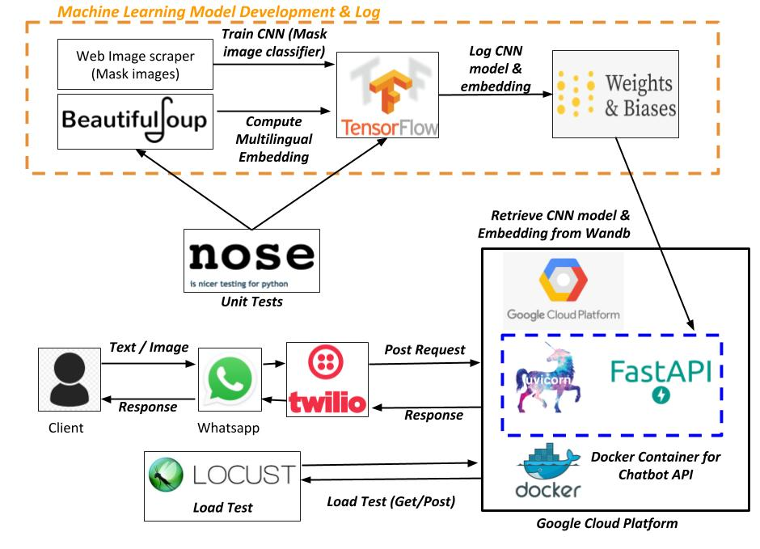
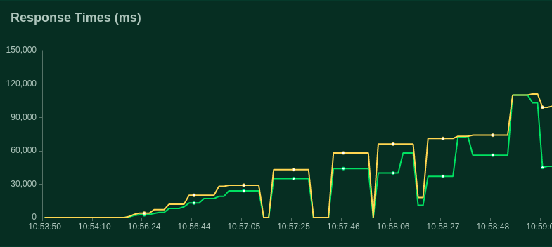
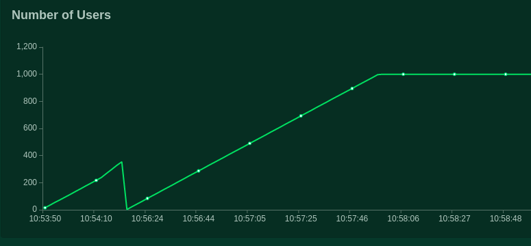

# Covid-19 Chatbot

**Covid-19 Chatbot** is...

<p align="center">
  
</p>


## Table of Contents
  * [**Features**](#features)
  * [**Usage**](#usage)
  * [**WhatsApp Integration**](#whatsapp-integration)
  * [**Data**](#data)
  * [**Language Model and Embeddings**](#language-model-and-embeddings)
  * [**Image Classification: Convolutional Neural Network**](#image-classification-convolutional-neural-network)
  * [**FastAPI**](#fastapi)
  * [**Deployment**](#deployment)
  * [**Load testing**](#load-testing)
  * [**API Docs**](#api-docs)
  * [**Future Improvements**](#future-improvements)


## Features
  * TODO **MORE TODO**
    * TODO

## Usage
  * TODO **MORE TODO**
      * TODO


## WhatsApp Integration
* Integrating the chatbot with WhatsApp allows for easier and greater reach with users
* Twilio is used to interface the chatbot with WhatsApp


## Data
> Two sources of data are sourced for the chatbot - text data (FAQs) and image data (mask images)

* Text data (FAQs)
  * TODO
* Image data (Mask images)
    * TODO


## Language Model & Embeddings
* TODO


## Image Classification: Convolutional Neural Network
* TODO

[**FastAPI**](#fastapi)

## FastAPI
* TODO


## Deployment
* The Docker containerized FastAPI is deployed on Google Cloud Platform, with the Uvicorn API server running in the container.
* All models and resources are retrieved from Weights and Biases
* GCP resource provision is kept minimal from a cost and demo perspective instead of using auto-scaling.


## Load testing: Locust
* Load tested the FastAPI endpoint deployed on GCP to quantify performance to traffic.
  * TODO
* TODO

<h2 align="center" id="response-time">
	
</h2>

<h2 align="center" id="rlocust-users">
	
</h2>


## API Docs
* Two forms of documentation is available for the FastAPI endpoint
  * ReDoc: As html included in this repo [here](https://github.com/seedatnabeel/covid_19_chatbot/tree/master/api-docs)
  * Swagger UI: via [Swagger docs](http://35.231.25.36/docs)


## Future Improvements
  > The chatbot has room for improvement to better the experience for production

  * The Question-Answer pairs can be increased to improve coverage of questions which can be answered.
  * If the reference database grows the .h5 could be replaced with a [FAISS index](https://github.com/facebookresearch/faiss) for more efficient search of a large number of embeddings.
  * A threshold can be set for the chatbot to return it does not know/is uncertain for out of sample questions
  * On GCP - more resources can be allocated for better response times & Nginx for load balancing.

## Font Installation

### `Option 1: Download and Install Manually`

> Best option for **quickly** getting a specific **individual font**.

Download the specific [patched font](#patched-fonts) of your choice

```sh
./install.sh
```
